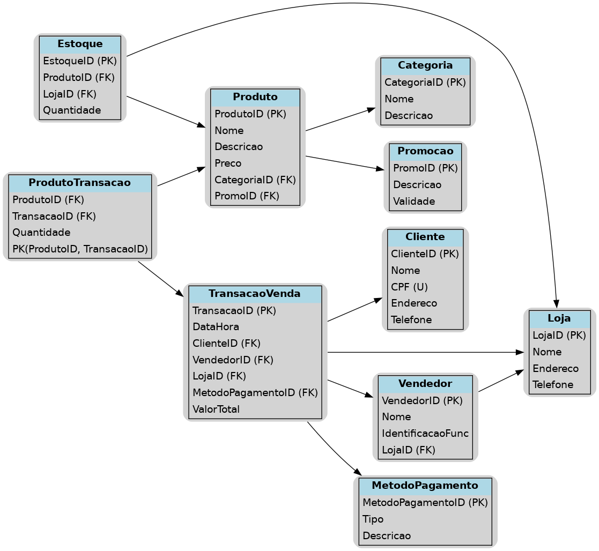

# PROJETO 1 - RELATÓRIO DE VENDAS

🎯 PROBLEMA DE NEGÓCIO:

Uma rede de varejo nacional, com atuação em lojas físicas e canais digitais, busca aprimorar sua análise de vendas e gestão de estoque por meio da construção de um banco de dados relacional e visualizações interativas em Power BI. O objetivo é consolidar informações de diversas áreas operacionais para facilitar a tomada de decisão estratégica..

Para   solucionar   essa   demanda,  desenvolvi um modelo de dados relacional em PostgreSQL que represente o processo de vendas da rede, incluindo entidades como clientes, vendedores, produtos, lojas, transações, métodos de pagamento, promoções e estoque. Em seguida, criar um painel interativo no Power BI para visualização dos principais indicadores de vendas.. 

---

📂 CONTÉM NESTE DIRETÓRIO:
- imgProj1.png: imagem de abertura do projeto referenciado neste README.
- diagPrj1: diagrama do modelo relacional do projeto
- imgDashProj1: Imagem do dashboard do projeto
- dicionario_dados.md: dicionário de dados do projeto

---

🔶 DIAGRAMA RELACIONAL 

---

🌐 LINK DASHBOARD
